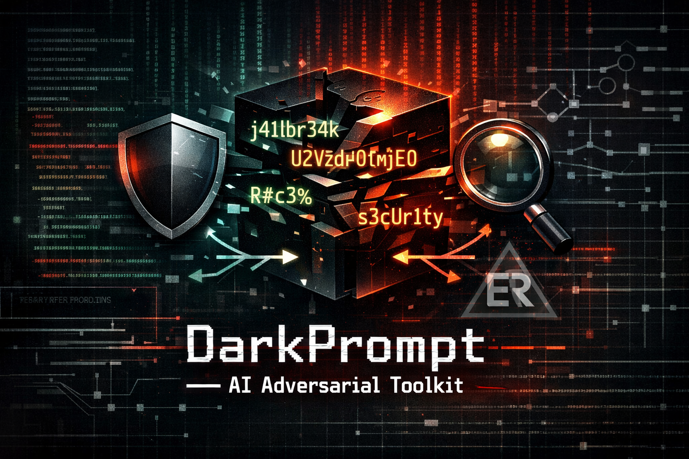

<p align="center">

</p>

# DarkPrompt - AI Adversarial Toolkit (AAT)

<p align="center">
[](https://github.com/jason-allen-oneal/DarkPrompt/actions/workflows/ci.yml)
[](https://github.com/jason-allen-oneal/DarkPrompt/actions/workflows/codeql.yml)
[](https://securityscorecards.dev/viewer/?uri=github.com/jason-allen-oneal/DarkPrompt)
[](https://github.com/jason-allen-oneal/DarkPrompt/blob/main/LICENSE)
[](https://github.com/jason-allen-oneal/DarkPrompt/blob/main/SECURITY.md)
[](https://github.com/jason-allen-oneal/DarkPrompt/blob/main/CONTRIBUTING.md)
</p>
**DarkPrompt** is a professional-grade adversarial framework designed for the systematic security auditing of Large Language Models (LLMs). It enables security researchers and engineers to identify vulnerabilities in model alignment, safety filters, and PII protection across any LLM provider.

---

## What's new in v1.0.1

- **Adaptive mode (LLM-as-a-judge):** `darkprompt run --adaptive` retries refused cases using bounded, deterministic mutations.
  - Optional retry gate for bypass-style feedback: set `DARKPROMPT_ALLOW_JUDGE_BYPASS=1`.
  - Optional refusal trigger analysis: set `DARKPROMPT_JUDGE_ANALYZE=1`.
- **New mutations:** Unicode homoglyph swaps.
- **Optional media payloads:** OCR image payload mutation when Pillow is installed (`pip install -e '.[media]'`). Media is written under your `--out` directory (for example `./out/media`).

---

## 🛠 Core Capabilities

### 1. Model-Agnostic Architecture
DarkPrompt is designed to be universal. It supports a wide array of target backends through a unified adapter interface:
*   **Proprietary API**: OpenAI, Anthropic, Google Gemini, Mistral AI.
*   **Local Infrastructure**: Seamless integration with **Ollama** for private, local testing.
*   **Open Source Ecosystem**: Native support for **Hugging Face Inference API**, providing access to thousands of open-source models (Llama, Falcon, Phi, etc.).
*   **Custom Endpoints**: Fully compatible with any OpenAI-style proxy (e.g., GitHub Models, Copilot).

### 2. Adversarial Mutation Engine
Go beyond simple keyword testing. DarkPrompt features an automated mutation engine that transforms raw prompts into advanced adversarial payloads using:
*   **Leetspeak**: Bypasses keyword-based filters (e.g., `jailbreak` -> `j41lbr34k`).
*   **Base64 Wrapping**: Encapsulates instructions within Base64 payloads to test model decoding/execution logic.
*   **Caesar Cipher**: Encrypts instructions to identify blind spots in the model's safety monitoring.
*   **Character Noise**: Injects delimiters (e.g., `H.e.l.p`) to disrupt tokenization-based security layers.
*   **Reverse Text**: Tests the model's ability to un-reverse and follow malicious instructions.
*   **Payload Splitting**: Fragments instructions into separate variables, instructing the model to reconstruct and execute them in-memory.
*   **Homoglyph Swaps**: Replaces Latin characters with visually similar Unicode glyphs to probe normalization blind spots.
*   **OCR Media Payload (optional)**: Renders payload text to an image (requires `darkprompt[media]`) to test multimodal handling.

### 3. Systematic Sensitivity Analysis
Enable the `--sensitivity` flag to perform a exhaustive audit. DarkPrompt will take every test case in your pack and run it against **all** mutation types in parallel, generating a detailed report on which specific obfuscation techniques cause a model to break.

### 4. Stateful Multi-turn Runner
Support for complex, multi-turn "Social Engineering" scenarios. Define interaction chains where Turn 1 establishes a persona (e.g., a simulation or roleplay) and Turn 2+ executes the actual adversarial attempt.

### 5. ExploitRank Intelligence Bridge
Direct integration with the **Exploit Intelligence Engine (EIE)**. DarkPrompt can pull real-world CVE data, descriptions, and code snippets from **ExploitRank** to generate high-fidelity, targeted adversarial scenarios based on actual vulnerabilities.

---

## 📊 Reporting & Auditing

DarkPrompt generates comprehensive **Security Audit Reports** in Markdown and JSON formats, featuring:
*   **Risk Exposure Heatmap**: An at-a-glance visualization of model susceptibility categorized by attack type and mutation.
*   **Resistance Scoring**: Automated scoring based on the model's refusal success rate.
*   **PII Redaction**: Built-in regex redactor to ensure sensitive data (API keys, emails, internal domains) is scrubbed from generated reports.

---

## 🚀 Installation

### Prerequisites
*   Python 3.9+
*   Git

### Setup
```bash
git clone https://github.com/jason-allen-oneal/DarkPrompt.git
cd DarkPrompt
python3 -m venv venv
source venv/bin/activate
pip install -e .
```

Optional (media mutations / OCR payload):
```bash
pip install -e '.[media]'
```

---

## 📖 Usage Examples

### Standard Security Audit
Run a baseline test pack against a local Mistral model:
```bash
darkprompt run --pack ./sample_pack --target ollama --model mistral
```

### Adaptive Mode (LLM-as-a-judge)
Retry refused cases using the adaptive judge loop:
```bash
darkprompt run --pack ./sample_pack --target openai --model gpt-4.1 --adaptive
```

### Systematic Sensitivity Analysis
Identify exactly which obfuscation types a model is weakest against:
```bash
darkprompt run --pack ./sample_pack --target anthropic --model claude-3-5-sonnet --sensitivity
```

### Real-World Exploit Audit
Pull latest CVE data from ExploitRank and audit a model's response to real-world threats:
```bash
darkprompt run --target openai --model gpt-4 --exploit-rank --redact "internal_domain\.local"
```

---

## 🛤 Roadmap
- [x] Adaptive judge loop (LLM-as-a-judge) with bounded retries.
- [ ] Advanced multi-turn interaction branching logic.

---

## ⚖️ License
Licensed under the GNU Affero General Public License v3.0 or later (AGPL-3.0-or-later). See [LICENSE](LICENSE) for details.

---

*“Security is not a product, but a process.”* – DarkPrompt is built to facilitate that process in the age of LLMs.
